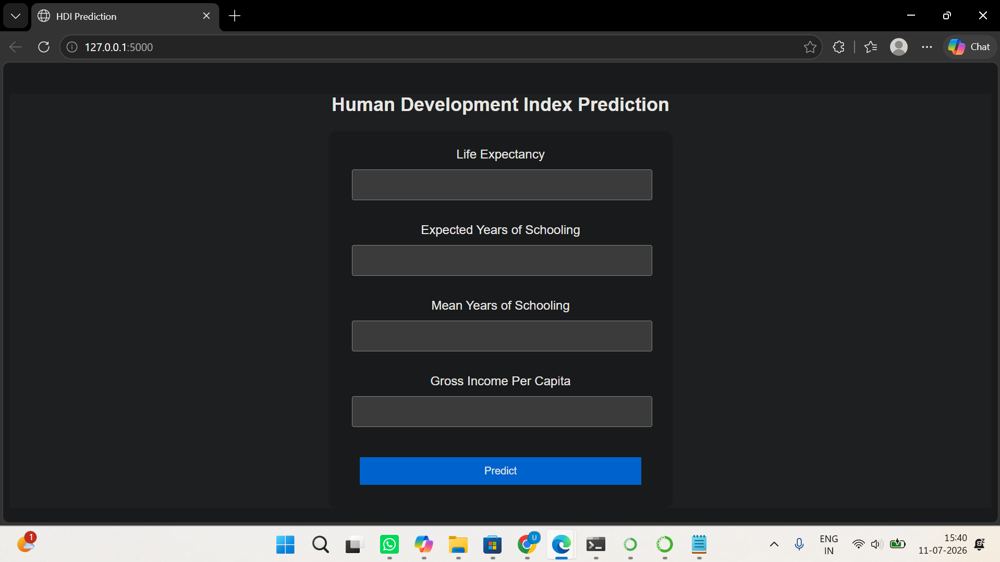
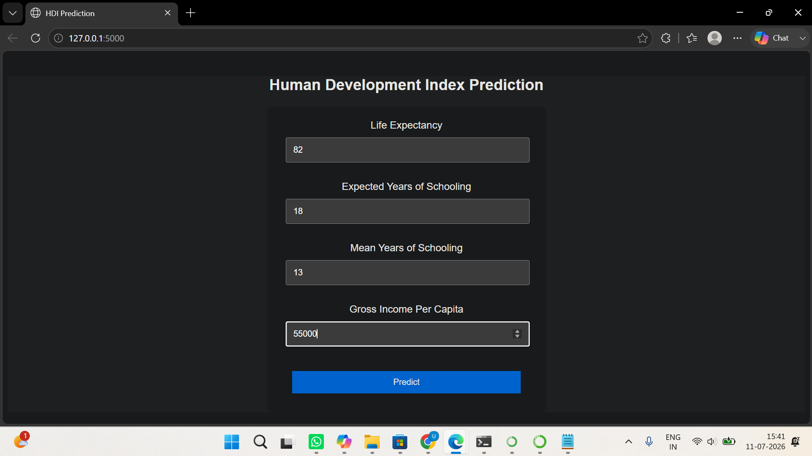
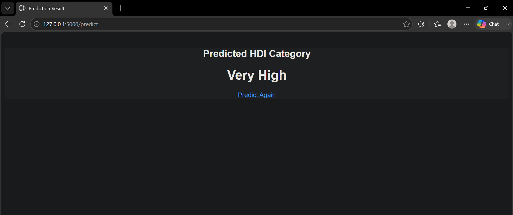

# 🌍 Human Development Index (HDI) Prediction Using Machine Learning

## 📌 Project Overview

The **Human Development Index (HDI) Prediction** project is a Machine Learning-based web application developed to predict the Human Development Index (HDI) category of a country using key socioeconomic indicators.

The application predicts whether a country belongs to one of the following HDI categories:

- 🟢 Very High
- 🔵 High
- 🟡 Medium
- 🔴 Low

The prediction is based on four important development indicators:

- Life Expectancy
- Expected Years of Schooling
- Mean Years of Schooling
- Gross Income Per Capita

The trained Machine Learning model is deployed using the **Flask** framework and provides predictions through an interactive web interface.

---

# 🎯 Problem Statement

Evaluating a country's Human Development Index (HDI) requires analyzing multiple socioeconomic indicators related to health, education, and income. Manual analysis is time-consuming and requires statistical expertise.

This project develops a Machine Learning-based prediction system that classifies countries into HDI categories using development indicators and provides quick predictions through a Flask web application.

---

# 🎯 Objectives

- Develop an HDI prediction model using Machine Learning.
- Analyze Human Development data using Exploratory Data Analysis (EDA).
- Compare multiple Machine Learning algorithms.
- Deploy the best-performing model using Flask.
- Provide a simple and user-friendly prediction interface.

---

# 🛠 Technologies Used

### Programming Language

- Python

### Libraries

- Pandas
- NumPy
- Matplotlib
- Seaborn
- Scikit-learn
- Joblib

### Web Framework

- Flask

### Frontend

- HTML5
- CSS3

### Tools

- Jupyter Notebook
- Anaconda
- Git
- GitHub
- Visual Studio Code

---

# 📂 Project Structure

```
HDI_Prediction/
│
├── dataset/
│   ├── hdr_general.csv
│   └── hdi_cleaned.csv
│
├── model/
│   ├── model.pkl
│   └── label_encoder.pkl
│
├── notebooks/
│   └── HDI_Analysis.ipynb
│
├── templates/
│   ├── index.html
│   └── result.html
│
├── static/
│   └── style.css
│
├── app.py
├── train_model.py
├── requirements.txt
├── README.md
└── .gitignore
```

---

# 📊 Dataset

Dataset Source:

**Human Development Report (HDR) Dataset**

### Features Used

- Life Expectancy
- Expected Years of Schooling
- Mean Years of Schooling
- Gross Income Per Capita

### Target

HDI Category

- Very High
- High
- Medium
- Low

---

# ⚙️ Machine Learning Workflow

1. Data Collection
2. Data Cleaning
3. Feature Selection
4. Exploratory Data Analysis (EDA)
5. Train-Test Split
6. Model Training
7. Model Evaluation
8. Model Saving
9. Flask Deployment

---

# 🤖 Machine Learning Models

The following Machine Learning algorithms were implemented and evaluated:

- Logistic Regression
- Decision Tree Classifier
- Random Forest Classifier
- K-Nearest Neighbors (KNN)

The best-performing model was saved and integrated into the Flask application.

---

# 📈 Exploratory Data Analysis (EDA)

EDA techniques performed include:

- Dataset Information
- Missing Value Analysis
- Statistical Summary
- Histograms
- Correlation Heatmap
- Boxplots
- Pairplots
- HDI Category Distribution

---

# 🚀 Installation

## Clone the Repository

```bash
git clone https://github.com/<your-username>/HDI-Prediction.git
```

Navigate to the project directory:

```bash
cd HDI-Prediction
```

Install dependencies:

```bash
pip install -r requirements.txt
```

---

# ▶️ Running the Application

Run the Flask application:

```bash
python app.py
```

Open your browser and visit:

```
http://127.0.0.1:5000
```

---

# 💻 Usage

1. Launch the application.
2. Enter:
   - Life Expectancy
   - Expected Years of Schooling
   - Mean Years of Schooling
   - Gross Income Per Capita
3. Click **Predict**.
4. View the predicted HDI category.
5. Click **Predict Again** to make another prediction.

---

# 📸 Application Screenshots

### Home Page
## 📸 Application Screenshots

### Home Page




### Prediction Result

### Input Form


### Prediction Result



---

# 📌 Sample Input

| Feature | Value |
|----------|------:|
| Life Expectancy | 82 |
| Expected Years of Schooling | 18 |
| Mean Years of Schooling | 13 |
| Gross Income Per Capita | 55000 |

### Prediction

```
Very High
```

---

# 🌟 Features

- User-friendly web interface
- Machine Learning-based prediction
- Multiple algorithm comparison
- Fast prediction
- Clean project structure
- Flask deployment

---

# 🔮 Future Scope

- Integrate real-time UNDP datasets.
- Improve prediction accuracy using advanced ML models.
- Add more socioeconomic indicators.
- Store prediction history in a database.
- Deploy the application on cloud platforms.
- Develop interactive dashboards.
- Implement Explainable AI (XAI) for prediction interpretation.

---

# 📚 References

- United Nations Development Programme (UNDP)
- Scikit-learn Documentation
- Flask Documentation
- Pandas Documentation
- NumPy Documentation
- Matplotlib Documentation
- Seaborn Documentation


